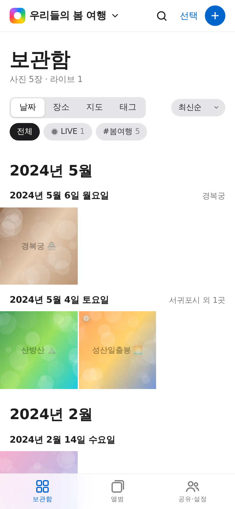
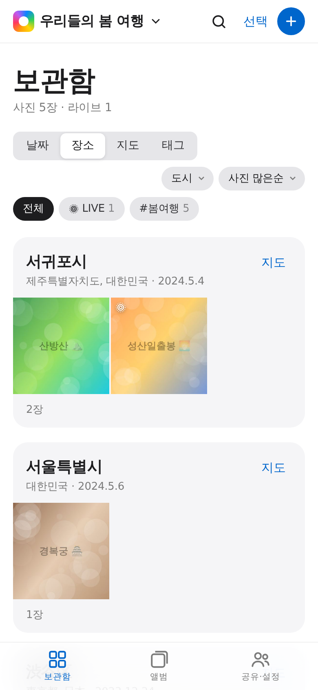
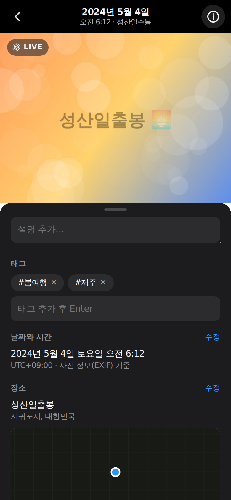
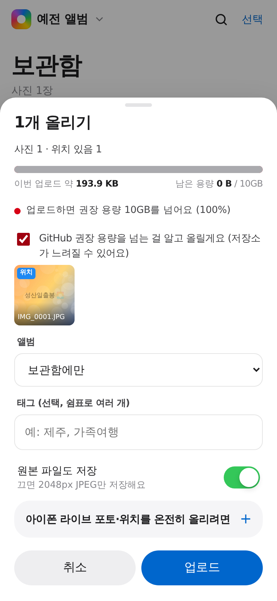

# Moa 📸 — GitHub에 담는 친구들과의 공유앨범

**비공개 GitHub 저장소를 사진 클라우드로 쓰는** 웹앱(PWA)입니다. 배포해 두면 누구든 **GitHub로 로그인만 해서** 앨범을 만들고 친구를 초대해 쓸 수 있어요. 빌드 과정이 없고, 아이폰 홈 화면에 앱처럼 설치할 수 있어요.

<p>




</p>

## 기능

| | |
|---|---|
| **업로드·조회** | 사진·동영상 여러 장을 한 번에 업로드 (데스크톱은 드래그&드롭). 중복 파일은 해시로 걸러내요. 원본 + 2048px 미리보기 + 썸네일을 저장하고, 본 사진은 기기에 캐시돼서 다음엔 바로 떠요 |
| **라이브 포토** | `IMG_1234.HEIC` + `IMG_1234.MOV`를 같이 올리면 자동으로 하나로 묶어요 (Apple 라이브 포토 ID → 파일 이름 → 촬영 시각 순으로 매칭). 사진을 열면 한 번 움직이고, **길게 누르면** 소리와 함께 재생돼요 |
| **날짜순** | EXIF 촬영 시각 + 시간대(`OffsetTimeOriginal`) 기준으로 월·일별 그룹. 최신순/오래된순 |
| **장소순** | GPS 좌표를 OpenStreetMap으로 동네 이름으로 바꿔서 **나라 / 도시 / 동네** 단위로 묶어요. 최근 방문순·사진 많은순·이름순 정렬 |
| **지도** | 사진 썸네일 핀이 지도 위에 모여서 보여요. 핀을 누르면 확대하거나 그 근처 사진 목록이 떠요 |
| **태그** | 사진 정보 창이나 여러 장 선택해서 태그 달기. 태그별 보기, 태그 칩으로 필터, 검색(태그·장소·설명·올린 사람) |
| **공유앨범** | 친구를 저장소 협업자로 초대하면 같은 보관함을 함께 채워요. 앨범 만들기, 좋아요, 댓글, 설명, 날짜·장소 직접 수정 |
| **동시 편집** | 모든 변경은 작은 "작업(op)"으로 기록되고, 커밋 직전에 최신 앨범 정보 위에 다시 적용돼요. 두 사람이 동시에 저장해도 서로 덮어쓰지 않아요 |
| **용량·제한 표시** | GitHub 저장소 한도 기준으로 남은 용량(10GB 중), 이번 업로드 예상 크기, 파일·폴더·저장 속도 한도 상태를 보여주고, 넘기 전에 경고해요 |

## 쓰는 사람: 로그인만 하면 끝

1. 배포된 Moa 주소를 열고 **GitHub로 시작하기** → GitHub에서 **Authorize** (계정이 없으면 무료 가입).
2. **새 앨범 만들기** → 이름만 적으면 내 GitHub 계정에 비공개 저장소가 자동으로 만들어져요.
3. 앨범의 **공유·설정 → 친구 초대하기**에 친구의 GitHub 아이디를 적고 **초대 보내기**.
4. 친구도 Moa에 GitHub로 로그인하면 **받은 초대**가 보여요 → **수락** → 같은 앨범을 함께 써요.
5. 아이폰에서는 Safari 공유 버튼 → *홈 화면에 추가*로 앱처럼 설치.

토큰 복사·붙여넣기, GitHub 설정 화면을 만질 필요가 없어요. (토큰으로 직접 연결하는 예전 방식도 첫 화면의 *토큰으로 직접 연결 (고급)*에 남아 있어요.)

## 배포하는 사람: 처음 한 번만 (10분)

"GitHub로 로그인"을 하려면 GitHub에 이 앱을 **OAuth App**으로 한 번 등록해야 해요. 로그인 과정에 비밀키(client secret)가 필요한데 그건 브라우저에 둘 수 없어서, `moa/api/auth/`의 작은 함수 4개가 Vercel에서 그 한 단계만 처리해요. 따로 서버를 운영하는 게 아니라 **저장소의 파일을 Vercel이 배포할 때 알아서 실행**하는 거예요.

1. **Vercel에 배포** — [vercel.com/new](https://vercel.com/new)에서 이 저장소를 Import → **Root Directory: `moa`**, Framework Preset: *Other*, 빌드 명령 없음 → Deploy. 주소가 생겨요 (예: `https://moa-xxx.vercel.app`).
2. **GitHub OAuth App 등록** — [github.com/settings/applications/new](https://github.com/settings/applications/new)
   - Application name: `Moa` (로그인 화면에 보이는 이름)
   - Homepage URL: `https://moa-xxx.vercel.app`
   - Authorization callback URL: `https://moa-xxx.vercel.app/api/auth/callback`
   - 등록 후 **Client ID**를 복사하고 **Generate a new client secret**으로 비밀키 생성·복사
3. **Vercel 환경 변수** — Project → Settings → Environment Variables에 `GITHUB_CLIENT_ID`, `GITHUB_CLIENT_SECRET` 추가 → **Redeploy**.

끝이에요. 이제 주소를 아는 누구나 로그인해서 쓸 수 있어요. 사진과 앨범 정보는 **각 사용자의 GitHub 저장소**에만 저장되고 Vercel에는 아무것도 남지 않아요 (GitHub Docs가 권장하는 "사용자 데이터는 사용자 계정에" 방식).

> - 콜백 주소는 한 도메인만 등록돼요. Vercel의 **미리보기(Preview) 주소에서는 로그인이 안 되고**, 위에 등록한 운영 주소에서만 돼요. 커스텀 도메인을 붙이면 OAuth App의 두 주소도 바꿔 주세요.
> - GitHub Enterprise라면 `GITHUB_URL`, `GITHUB_API_URL`도 설정하고 `vercel.json`의 `connect-src`에 API 주소를 추가하세요.
> - GitHub Pages처럼 함수를 못 돌리는 곳에 올리면 로그인 버튼이 자동으로 숨고, 토큰 연결 방식으로만 동작해요.

### 권한과 보안

- GitHub에 요청하는 권한은 **`repo`** 하나예요. 앨범용 비공개 저장소를 만들고, 친구를 초대하고, 초대를 수락하려면 이 권한이 필요해요. OAuth App에는 "이 저장소만" 같은 더 좁은 권한이 없어서, 이 권한은 **본인의 다른 비공개 저장소에도 접근할 수 있어요.** 로그인 화면에도 그렇게 표시돼요.
- 그래서 토큰은 브라우저에만 저장하고, 서버는 토큰을 보관하지 않아요. 페이지에는 **외부 스크립트가 하나도 없고**(라이브러리는 모두 저장소에 포함), `vercel.json`의 CSP로 스크립트는 자기 도메인, 네트워크 요청은 GitHub API와 지명 검색으로만 제한해요.
- **로그아웃**하면 GitHub 쪽 권한도 취소(revoke)되고 이 기기의 사진 캐시도 지워요. GitHub의 *Settings → Applications → Authorized OAuth Apps*에서도 언제든 해제할 수 있어요.

### 여러 앨범 = 여러 저장소

GitHub 권한은 저장소 단위라서, **누구와 공유하느냐에 따라 저장소를 나누는 게** 가장 깔끔해요. 예: `my-cloud`(나 혼자), `family-photos`(가족), `trip-2026`(여행 친구들). 앱 상단 제목을 누르면 저장소를 전환할 수 있어요. 한 저장소 안의 "앨범"은 정리용 묶음이에요 (저장소 멤버는 모두 볼 수 있음).

## 아이폰 사진을 제대로 올리는 법

| 방법 | 날짜 | 위치 | 라이브 포토 |
|---|---|---|---|
| 업로드 → **사진 보관함**에서 바로 선택 | ✅ | iOS 설정에 따라 빠질 수 있음 | ❌ (정지 사진만 전달됨) |
| 사진 앱 **공유 → 옵션 → 모든 사진 데이터** 켜기 → **파일에 저장** → 업로드 → **찾아보기**에서 HEIC+MOV 함께 선택 | ✅ | ✅ | ✅ |

iOS의 사진 선택기는 웹페이지에 라이브 포토의 영상 부분을 넘겨주지 않아요. 그래서 라이브 포토를 살리려면 "파일에 저장" 경로를 쓰세요. 위치가 빠진 사진은 사진 정보 → 장소 **수정**에서 검색해서 넣을 수 있어요.

## 저장소 구조

```
album.json                        앨범 이름·멤버·앨범 목록 (작음)
index/2026-09.json                촬영 월별 사진 정보·태그·좋아요·댓글 (사진 1장 = 1줄)
media/2026/09/24/<id>.heic        원본
media/2026/09/24/<id>.live.mov    라이브 포토 영상
preview/2026/09/24/<id>.jpg       2048px JPEG (모든 브라우저에서 표시)
thumb/2026/09/24/<id>.jpg         그리드 썸네일
```

업로드 묶음(최대 10장/50MB)마다 커밋 1개가 생기고, Git Data API로 파일과 **바뀐 월 파일만** 한 번에 커밋해요. 다른 사람이 먼저 커밋했으면(fast-forward 실패) 최신 상태를 다시 읽고 재시도합니다. 예전 형식(`index.json` 하나)의 앨범은 처음 저장할 때 자동으로 새 형식으로 바뀌어요.

## GitHub 저장소 한도와 Moa

[GitHub Docs "Repository limits"](https://docs.github.com/en/repositories/creating-and-managing-repositories/repository-limits) 기준이에요. **공유·설정 → GitHub 저장소 한도**에서 현재 상태를 볼 수 있어요.

| GitHub 한도 | Moa가 하는 일 |
|---|---|
| 저장소 크기 권장 최대 **10GB** | 남은 용량 링·보관함 경고 배너(80%/95%), 업로드 전 "이번 업로드 약 X · 남은 용량 Y" 막대. 10GB를 넘기는 업로드는 확인 체크를 해야 올라가요. 크기는 GitHub가 잰 값(삭제 이력 포함, 늦게 갱신)과 앨범 합계 중 큰 쪽을 써요 |
| 파일 1개 **100MB 강제** / 권장 1MB | 100MB 넘는 파일은 제외, 50MB 넘는 파일은 "대용량" 표시(브라우저 업로드가 실패할 수 있음). 원본은 대부분 1MB를 넘어서, 원본 저장을 끄면 얼마나 줄어드는지 알려줘요 |
| 폴더당 **3,000개** | 날짜별 폴더(`YYYY/MM/DD`)에 저장하고 가장 붐비는 폴더를 보여줘요 |
| 폴더 깊이 50 | 최대 5단계라 해당 없음 |
| 푸시 **분당 6회** | 저장(커밋)을 스스로 분당 6회 이하로 조절하고, 편집은 몇 초씩 모아서 한 번에 저장해요 |
| 앨범 정보 파일 권장 1MB | `index.json` 하나 대신 월별 파일로 나눠서 한 파일이 커지지 않게 해요 |

Git LFS가 권장되지만, GitHub의 LFS 서버는 브라우저에서 직접 호출할 수 없어서(CORS) 이 앱은 일반 Git 저장소만 써요.

## 알아둘 한계

- **용량**: 위 표 참고. 여유 있게 쓰려면 모임별·연도별로 저장소를 나누고, 필요하면 **원본 파일도 저장**을 끄세요 (JPEG만 저장, 라이브 영상은 유지).
- **삭제해도 용량이 줄지 않아요**: Git 이력에 남기 때문이에요. 완전히 지우려면 저장소를 새로 만들어야 해요.
- **요청 한도**: 토큰당 시간당 5,000회. 한 번에 수백 장을 올리면 GitHub의 보조 한도에 걸릴 수 있는데, 앱이 자동으로 기다렸다가 이어서 올려요.
- **라이브 영상 코덱**: 아이폰 라이브 영상은 보통 HEVC라서 Safari·macOS에서는 잘 재생되지만, 일부 Windows/Android 브라우저에서는 정지 사진만 보일 수 있어요.
- **HEIC 올리기**: 아이폰·맥의 Safari에서는 바로 돼요. 다른 브라우저(Windows Chrome 등)는 HEIC를 못 읽어서 JPEG로 바꿔 올려야 해요. 변환 라이브러리가 `eval`을 써서 보안 정책(CSP)상 넣지 않았어요. 보는 쪽은 항상 JPEG 미리보기라 어디서나 보여요.
- **장소 이름**: OpenStreetMap Nominatim(초당 1회 제한)을 써서, 올린 뒤 몇 초~몇 분에 걸쳐 채워져요. 설정에서 끌 수 있어요.
- 로그인 정보는 브라우저 `localStorage`에 저장돼요. 공용 기기에서는 쓰고 나서 **로그아웃**하세요.
- 사진을 보려면 GitHub 계정이 있어야 해요 (저장소가 비공개라서요).

## 배포 · 실행

위의 Vercel 배포를 권장해요. 로컬에서 보기만 하려면 (로그인 버튼은 숨고 토큰 연결만 돼요):

```bash
cd moa && npx http-server -p 8080 -c-1 .     # → http://localhost:8080
```

HTTPS(또는 localhost)가 필요해요 (서비스 워커, 해시 계산).

## 테스트

```bash
cd moa
npm test        # 순수 로직 + 로그인 함수(state 검사, 코드 교환, 권한 취소)
npm run e2e     # Playwright: 가짜 GitHub로 로그인 → 앨범 생성 → 업로드 → 아이디로 초대 → 친구가 로그인해 수락 → 함께 편집 → 로그아웃 (--shots <dir> 로 스크린샷)
```

e2e 테스트는 실제 `/api/auth/*` 함수를 가짜 github.com 로그인 화면과 연결하고, GitHub API는 `test/mock-github.mjs`(저장소 생성·초대·fast-forward 검사까지 흉내 내는 인메모리 API)로 대체해요. 운영과 같은 CSP를 걸고 위반이 있으면 실패해요. 지도 타일·지명 검색은 가짜 응답이에요.

## 파일

| 파일 | 역할 |
|---|---|
| `js/core.js` | DOM 없는 순수 로직: index 형식, 편집 op, 그룹/정렬, EXIF→필드, QuickTime atom 파서, Apple MakerNote(라이브 포토 ID), 라이브 포토 매칭 |
| `js/github.js` | GitHub REST 클라이언트: 월별 파일 읽기/쓰기, 원자적 커밋 + 충돌 재시도, 분당 6회 저장 조절, 미디어 캐시 |
| `api/auth/*.js`, `server/oauth.js` | GitHub 로그인(OAuth) — 설정 확인, 로그인 이동, 콜백에서 토큰 교환, 로그아웃 시 권한 취소. Vercel 함수로 실행 |
| `vercel.json` | 보안 헤더(CSP 등) |
| `js/limits.js` | GitHub 저장소 한도 계산: 남은 용량, 업로드 예상 크기, 폴더·파일 한도, 푸시 속도 |
| `js/media.js` | 파일 분석(해시·메타데이터), HEIC 디코딩, JPEG 미리보기/썸네일 생성 |
| `js/geo.js` | Nominatim 역지오코딩·장소 검색 (1초 간격, 캐시) |
| `js/app.js` | UI: 보관함(날짜·장소·지도·태그), 앨범, 공유·설정, 뷰어, 업로드 |
| `vendor/` | [exifr](https://github.com/MikeKovarik/exifr) (MIT), [Leaflet](https://leafletjs.com) (BSD-2) |

디자인은 [`design-md/apple/DESIGN.md`](../design-md/apple/DESIGN.md)의 사진 중심 언어(흰/파치먼트 캔버스, SF 타이포, Action Blue 하나, 알약 버튼)를 따르고, 다크 모드를 지원해요. 움직임과 손맛은 [Emil Kowalski의 디자인 엔지니어링 원칙](https://github.com/emilkowalski/skill)을 따랐어요: 썸네일에서 사진이 커지는 확대 전환, 손가락을 따라오다 살짝 튕기면 닫히는 뷰어·시트, 모든 버튼의 눌림 반응, 마우스에서만 켜지는 hover, 커스텀 easing(들어올 땐 drawer 곡선, 나갈 땐 더 빠르게), transform/opacity만 쓰는 애니메이션, 줄인 모션 설정 존중.
